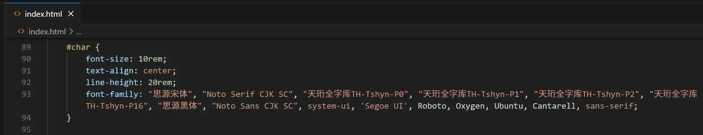
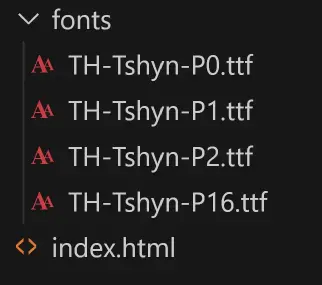
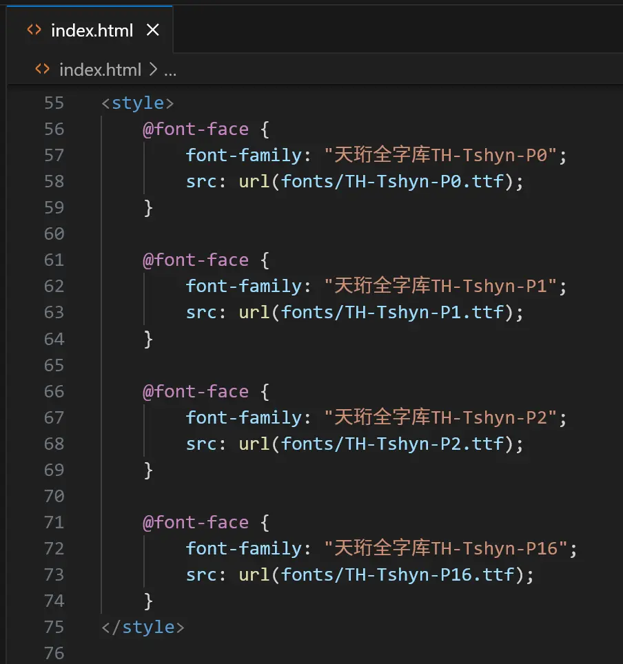

## Unicode 快闪

一个演示Unicode快闪的网页程序。支持本地运行。可以自由定制样式。

### 如何使用

1. [下载](https://github.com/kqakqakqa/unicode-flash/archive/refs/heads/main.zip)并解压此项目；

2. 使用浏览器打开 [index.html](https://kqakqakqa.github.io/unicode-flash) 。

## 如何自定义字体

### 方法1

在 index.html > style > #char > font-family 中加入字体。需要在设备上已安装该字体：

（此列表为字体的备用显示顺序，缺失某个字的字形/缺失字体时将会按顺序使用下一个字体）

### 方法2

将字体文件放入 fonts 文件夹：

在 index.html > style > @font-face 中加入字体：

在 index.html > style > #char > font-family 中加入字体：

（此列表为字体的备用显示顺序，缺失某个字的字形/缺失字体时将会按顺序使用下一个字体）
